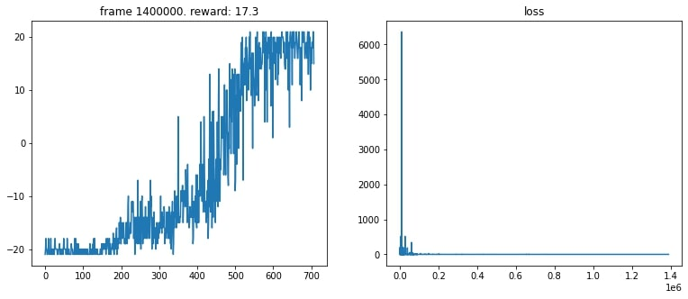

# Vision-Transformers-for-Intelligent-Agents
Here we try to replace the existing Convolutionalarchitecture in a Deep Q-learning agent with the current widelyresearched architecture i.e. Transformers. Both the models aretrained to play ’Pong’ a famous Atari game. Subsequent results are documented and remarks have been made on the same

Implementation of Vision Transfermers in a Deep Q-learning agent to play the Atari game Pong. For the pytorch ViT implementation please see Phil Wang's repository [here](https://github.com/lucidrains/vit-pytorch). Also you can find implementations of different Reinforcement learning agents [here](https://github.com/higgsfield/RL-Adventure).

## Install Required Dependencies

```bash
$ python -m pip install -r requirements.txt
```
## Usage

```python
model = ViT(
        image_size=env.observation_space.shape[1], 
        patch_size=12,
        num_classes=env.action_space.n,
        channels=env.observation_space.shape[0],
        dim = 256,
        depth = 2,
        heads = 2,
        mlp_dim = 128
)
```
Change the parameters stated above to tweak ViT architecture. Other hyperparameters which we can change for the DQN agent are
```python
num_frames = 1400000
batch_size = 32
gamma      = 0.99
epsilon_start = 1.0
epsilon_final = 0.01
epsilon_decay = 30000
```

- `image_size`: int.  
Image size. If you have rectangular images, make sure your image size is the maximum of the width and height
- `patch_size`: int.  
Number of patches. `image_size` must be divisible by `patch_size`.  
The number of patches is: ` n = (image_size // patch_size) ** 2` and `n` **must be greater than 16**.
- `num_classes`: int.    
Number of Transformer blocks.
- `heads`: int.  
Number of heads in Multi-head Attention layer. 
- `mlp_dim`: int.  
Dimension of the MLP (FeedForward) layer.
- `gamma`: float between `(0, 1)`.  
Also called the discount factor. Signifies how much importance should be given on future rewards
- `epsilon_*`: float.  
Balance exploration and exploitation

## Training

```python
losses = []
all_rewards = []
episode_reward = 0

state = env.reset()
for frame_idx in range(1, num_frames + 1):
    epsilon = epsilon_by_frame(frame_idx)
    action = model.act(state, epsilon)
    
    next_state, reward, done, _ = env.step(action)
    replay_buffer.push(state, action, reward, next_state, done)
    
    state = next_state
    episode_reward += reward
    
    if done:
        state = env.reset()
        all_rewards.append(episode_reward)
        episode_reward = 0
        
    if len(replay_buffer) > replay_initial:
        loss = compute_td_loss(batch_size)
        losses.append(loss.item())
        
    if frame_idx % 10000 == 0:
        plot(frame_idx, all_rewards, losses)
```
Run the above code to start training the model. You'd see plots of average reward and loss that update every 1000 episodes. This is an example plot of the CNN net which we trained for 1.4 million episodes.  

</img>   

## Saving Model Weights
Run the following command to save your model state dict in a `.pth` file  
```python
PATH = './cnn_net.pth'
torch.save(model.state_dict(), PATH)
```
